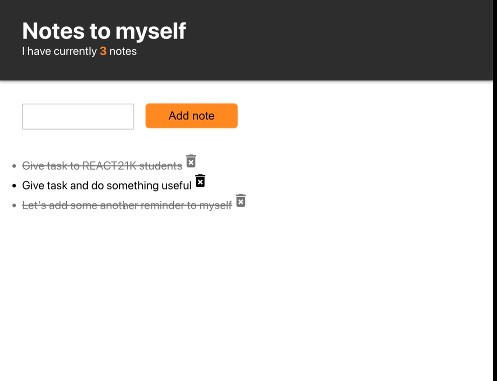

# ToDoList school project

## Main task



1. To do list of tasks for "myself"
2. Follow given Styles
3. on click - the task should be crossed
4. on pressing delete icon it should be deleted

## Technologies used:

### Built with:

- React
- JavaScript
- Json Server
- React Bootstrap
- HTML
- CSS

#

### it is open source. Clone it and

```js
npm install
npm install/yarn add redux-thunk redux react-redux
npm install/yarn add redux-devtools-extension
npm install react-bootstrap bootstrap@4.6.0
npm install @material-ui/core
npm install @material-ui/icons

```

#

### Authors and acknowledgment:

### Julia Matvi: [GitHub](https://github.com/jualiasha), [LinkedIn](www.linkedin.com/in/jualiasha)
